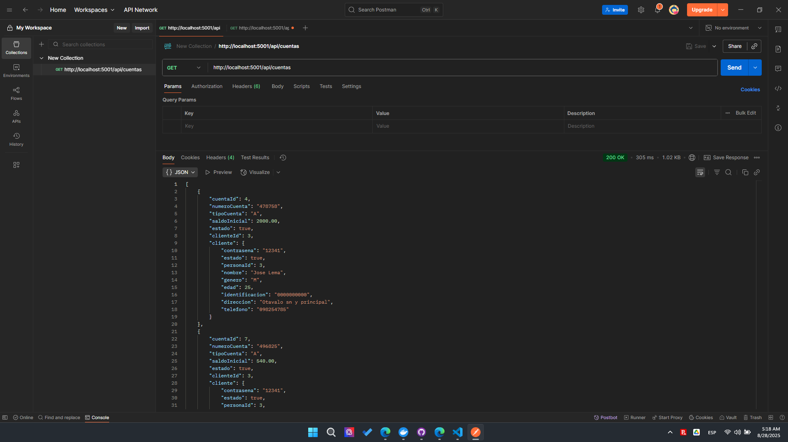
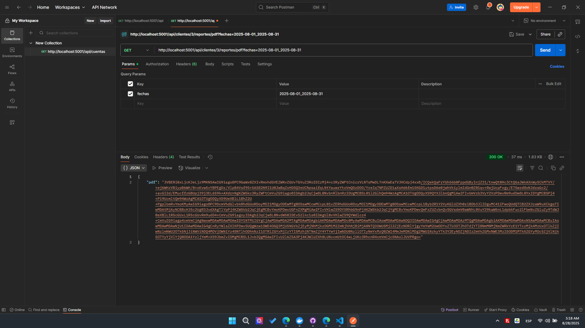
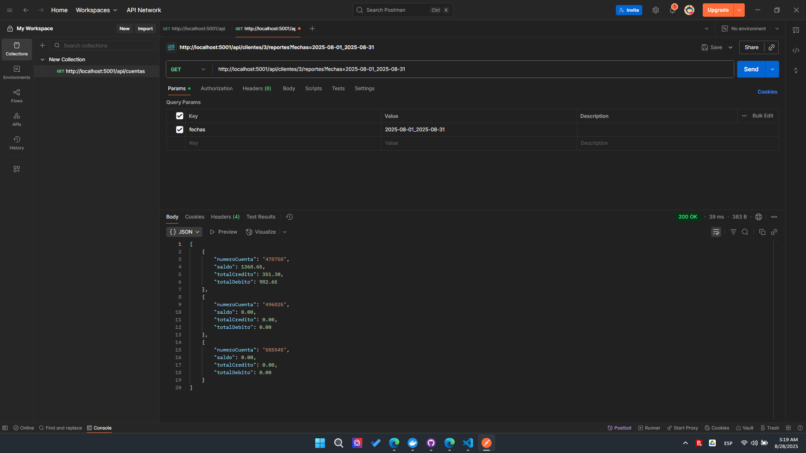
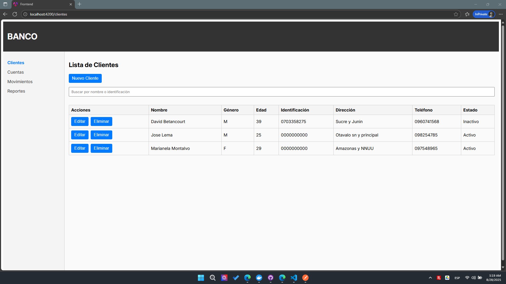
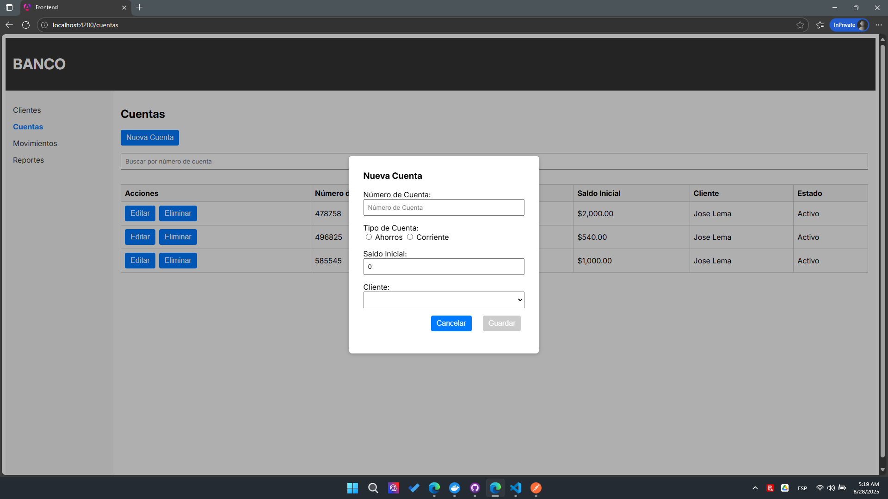
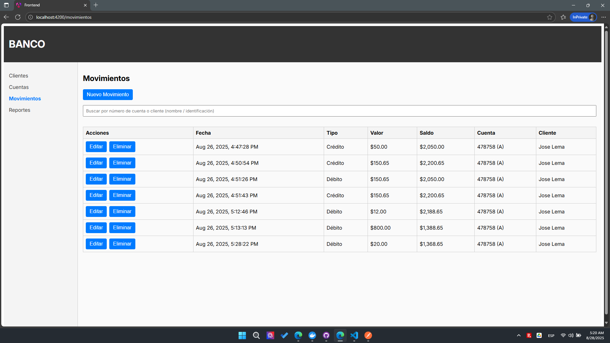
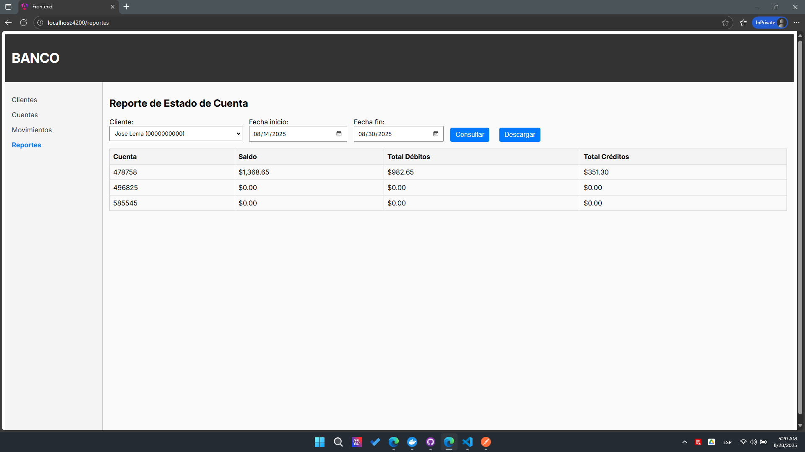

# Prueba Técnica para Devsu

### Desarollado por David Betancourt N.

Este repositorio contiene una solución fullstack para la prueba técnica de Devsu, compuesta por un backend en .NET, un frontend en Angular y el script para la base de datos.

## Backend (.NET)

- **Ubicación:** `Backend/src/Backend.Api`
- **Framework:** .NET 8
- **Pruebas:** `Backend/tests/TestProject1`

## Frontend (Angular)

- **Ubicación:** `Frontend/src/app`
- **Framework:** Angular 19

## Base de Datos

- **Script:** `BaseDatos.sql`
- Contiene la estructura para la base de datos utilizada por el backend.

## Docker

- Archivos `Dockerfile` disponibles en `Backend/` y `Frontend/` para despliegue en contenedores.

## Autor

David Betancourt N

## Capturas

